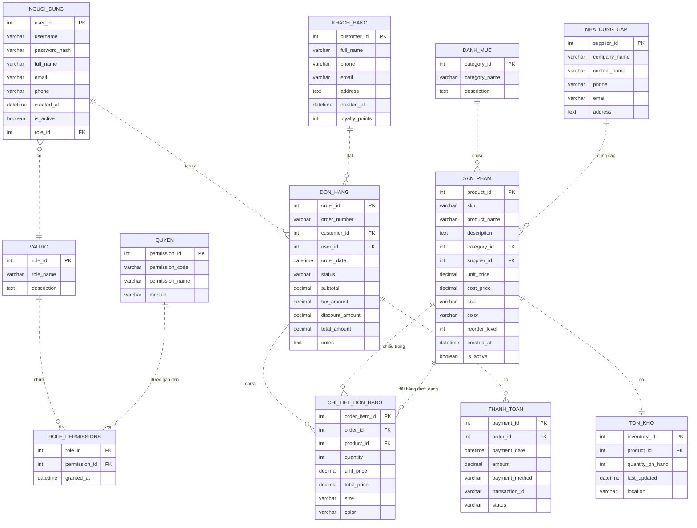

# Thiết kế CSDL cho Ứng dụng quản lý doanh số bán hàng tại cửa hàng quần áo

## Tổng quan

Tài liệu này mô tả mô hình Quan hệ-Entity (ER) cho hệ thống quản lý doanh số bán hàng chuyên dụng cho cửa hàng bán lẻ quần áo. Hệ thống bao gồm quản lý tài khoản người dùng với quyền dựa trên vai trò (phân quyền account) để kiểm soát truy cập vào các chức năng khác nhau.

## Các Thực thể và Thuộc tính

### 1. Người dùng (Người dùng)

| Thuộc tính | Kiểu | Mô tả |
|-|-|-|
| user_id | PK, INT | Định danh duy nhất |
| username | VARCHAR(50) | Tên đăng nhập |
| password_hash | VARCHAR(255) | Mật khẩu đã được băm |
| full_name | VARCHAR(100) | Họ và tên đầy đủ |
| email | VARCHAR(100) | Email liên hệ |
| phone | VARCHAR(20) | Số điện thoại |
| created_at | DATETIME | Thời gian tạo tài khoản |
| is_active | BOOLEAN | Trạng thái tài khoản |

### 2. Vai trò (Vai trò)

| Thuộc tính | Kiểu | Mô tả |
|-----------|------|-------------|
| role_id | PK, INT | Định danh duy nhất |
| role_name | VARCHAR(50) | Ví dụ: 'Admin', 'Quản lý', 'Nhân viên' |
| description | TEXT | Mô tả vai trò |

### 3. Quyền (Quyền)

| Thuộc tính | Kiểu | Mô tả |
|-----------|------|-------------|
| permission_id | PK, INT | Định danh duy nhất |
| permission_code | VARCHAR(50) | Ví dụ: 'PRODUCT_READ', 'ORDER_DELETE' |
| permission_name | VARCHAR(100) | Mô tả dễ đọc |
| module | VARCHAR(50) | Khu vực chức năng (PRODUCT, ORDER, USER, REPORT) |

### 4. RolePermissions (Nhiều-nhiều giữa Vai trò và Quyền)

| Thuộc tính | Kiểu | Mô tả |
|-----------|------|-------------|
| role_id | FK, INT | Tham chiếu Roles.role_id |
| permission_id | FK, INT | Tham chiếu Permissions.permission_id |
| granted_at | DATETIME | Thời điểm được cấp quyền |

### 5. Danh mục (Danh mục sản phẩm)

| Thuộc tính | Kiểu | Mô tả |
|-----------|------|-------------|
| category_id | PK, INT | Định danh duy nhất |
| category_name | VARCHAR(100) | Ví dụ: 'Áo', 'Quần', 'Váy' |
| description | TEXT | Mô tả danh mục |

### 6. Nhà cung cấp (Nhà cung cấp)

| Thuộc tính | Kiểu | Mô tả |
|-----------|------|-------------|
| supplier_id | PK, INT | Định danh duy nhất |
| company_name | VARCHAR(150) | Tên nhà cung cấp |
| contact_name | VARCHAR(100) | Người liên hệ |
| phone | VARCHAR(20) | Số điện thoại |
| email | VARCHAR(100) | Email |
| address | TEXT | Địa chỉ |

### 7. Sản phẩm (Sản phẩm)

| Thuộc tính | Kiểu | Mô tả |
|-----------|------|-------------|
| product_id | PK, INT | Định danh duy nhất |
| sku | VARCHAR(50) | Mã tồn kho (SKU) |
| product_name | VARCHAR(200) | Tên sản phẩm |
| description | TEXT | Mô tả chi tiết |
| category_id | FK, INT | Tham chiếu Categories.category_id |
| supplier_id | FK, INT | Tham chiếu Suppliers.supplier_id |
| unit_price | DECIMAL(10,2) | Giá bán |
| cost_price | DECIMAL(10,2) | Giá nhập |
| size | VARCHAR(20) | Kích thước (S, M, L, XL, v.v.) |
| color | VARCHAR(50) | Màu sắc |
| reorder_level | INT | Mức tồn tối thiểu để nhập lại |
| created_at | DATETIME | Thời gian tạo bản ghi |
| is_active | BOOLEAN | Tình trạng có sẵn của sản phẩm |

### 8. Tồn kho (Tồn kho)

| Thuộc tính | Kiểu | Mô tả |
|-----------|------|-------------|
| inventory_id | PK, INT | Định danh duy nhất |
| product_id | FK, INT | Tham chiếu Products.product_id |
| quantity_on_hand | INT | Số lượng tồn kho hiện có |
| last_updated | DATETIME | Thời gian cập nhật tồn kho lần cuối |
| location | VARCHAR(100) | Vị trí kho/cửa hàng (nếu có nhiều vị trí) |

### 9. Khách hàng (Khách hàng)

| Thuộc tính | Kiểu | Mô tả |
|-----------|------|-------------|
| customer_id | PK, INT | Định danh duy nhất |
| full_name | VARCHAR(100) | Tên khách hàng |
| phone | VARCHAR(20) | Số điện thoại |
| email | VARCHAR(100) | Email |
| address | TEXT | Địa chỉ giao hàng/thanh toán |
| created_at | DATETIME | Thời gian tạo tài khoản |
| loyalty_points | INT | Điểm thành viên tùy chọn (chương trình thành viên) |

### 10. Đơn hàng (Đơn hàng)

| Thuộc tính | Kiểu | Mô tả |
|-----------|------|-------------|
| order_id | PK, INT | Định danh duy nhất |
| order_number | VARCHAR(50) | Mã đơn hàng có thể đọc được |
| customer_id | FK, INT | Tham chiếu Customers.customer_id (có thể null cho khách mua không thành viên) |
| user_id | FK, INT | Tham chiếu Users.user_id (nhân viên tạo đơn hàng) |
| order_date | DATETIME | Thời gian đặt hàng |
| status | VARCHAR(20) | Ví dụ: 'Đang xử lý', 'Đang giao', 'Đã giao', 'Đã hủy' |
| subtotal | DECIMAL(10,2) | Tổng tiền trước thuế/giảm giá |
| tax_amount | DECIMAL(10,2) | Số tiền thuế |
| discount_amount | DECIMAL(10,2) | Số tiền giảm giá |
| total_amount | DECIMAL(10,2) | Tổng số tiền phải trả |
| notes | TEXT | Ghi chú bổ sung |

### 11. Chi tiết đơn hàng (Chi tiết đơn hàng)

| Thuộc tính | Kiểu | Mô tả |
|-----------|------|-------------|
| order_item_id | PK, INT | Định danh duy nhất |
| order_id | FK, INT | Tham chiếu Orders.order_id |
| product_id | FK, INT | Tham chiếu Products.product_id |
| quantity | INT | Số lượng đặt hàng |
| unit_price | DECIMAL(10,2) | Giá tại thời điểm đặt hàng |
| total_price | DECIMAL(10,2) | Số lượng * đơn giá |
| size | VARCHAR(20) | Kích thước đã chọn |
| color | VARCHAR(50) | Màu sắc đã chọn |

### 12. Thanh toán (Thanh toán)

| Thuộc tính | Kiểu | Mô tả |
|-----------|------|-------------|
| payment_id | PK, INT | Định danh duy nhất |
| order_id | FK, INT | Tham chiếu Orders.order_id |
| payment_date | DATETIME | Thời gian thanh toán |
| amount | DECIMAL(10,2) | Số tiền thanh toán |
| payment_method | VARCHAR(50) | Ví dụ: 'Tiền mặt', 'Thẻ tín dụng', 'Chuyển khoản ngân hàng' |
| transaction_id | VARCHAR(100) | Mã giao dịch từ cổng thanh toán (nếu có) |
| status | VARCHAR(20) | Ví dụ: 'Đang chờ', 'Hoàn thành', 'Thất bại', 'Hoàn tiền' |

## Các Quan hệ

- **Người dùng 1:N Vai trò** (qua RolePermissions nhiều-nhiều, nhưng mỗi người dùng có một vai trò; chúng ta có thể thêm role_id trực tiếp vào bảng Người dùng để đơn giản hóa)
  - Thực tế, chúng ta sẽ thêm `role_id` FK trong bảng Người dùng tham chiếu Vai trò.role_id.

- **Vai trò N:M Quyền** qua bảng trung gian RolePermissions.

- **Danh mục 1:N Sản phẩm** (mỗi sản phẩm thuộc về một danh mục).

- **Nhà cung cấp 1:N Sản phẩm** (mỗi sản phẩm được cung cấp bởi một nhà cung cấp).

- **Sản phẩm 1:N Tồn kho** (mỗi sản phẩm có một bản ghi tồn kho; có thể có nhiều bản ghi nếu có nhiều vị trí).

- **Sản phẩm 1:N Chi tiết đơn hàng** (mỗi sản phẩm có thể xuất hiện trong nhiều chi tiết đơn hàng).

- **Đơn hàng 1:N Chi tiết đơn hàng** (mỗi đơn hàng có nhiều mục hàng).

- **Khách hàng 1:N Đơn hàng** (mỗi khách hàng có thể đặt hàng nhiều lần).

- **Người dùng 1:N Đơn hàng** (mỗi người dùng/nhân viên có thể tạo nhiều đơn hàng).

- **Đơn hàng 1:N Thanh toán** (một đơn hàng có thể có nhiều thanh toán, ví dụ: đặt cọc + thanh toán phần còn lại).

## Biểu đồ ER (Cú pháp Mermaid)

## Ghi chú triển khai

1. **Xác thực & Ủy quyền**
   - Mật khẩu nên được băm bằng một thuật toán mạnh (ví dụ: bcrypt).
   - Kiểm soát truy cập dựa trên vai trò (RBAC) được triển khai qua các bảng `Vai trò`, `Quyền`, và `RolePermissions`.
   - Bảng `Người dùng` bao gồm khóa ngoại `role_id` để gán vai trò cho mỗi người dùng.

2. **Quản lý tồn kho**
   - Bảng `Tồn kho` theo dõi mức tồn kho theo thời gian thực. Khi một đơn hàng được đặt, hệ thống nên giảm `quantity_on_hand` tương ứng.
   - Trường `reorder_level` trong `Sản phẩm` giúp kích hoạt cảnh báo nhập hàng.

3. **Xử lý đơn hàng**
   - Một đơn hàng có thể được liên kết với một `Khách hàng` đã đăng ký hoặc để trống cho khách mua lẻ (không thành viên).
   - Bảng `Đơn hàng` lưu trữ các tổng tiền đã tính toán (`subtotal`, `tax_amount`, `discount_amount`, `total_amount`) để báo cáo hiệu quả, nhưng cũng có thể được suy ra từ `Chi_tiết_đơn_hàng`.

4. **Thanh toán**
   - Cho phép nhiều thanh toán cho mỗi đơn hàng (ví dụ: đặt cọc + thanh toán còn lại). Trường `status` theo dõi vòng đời thanh toán.

5. **Khả năng mở rộng**
   - Các mô-đun bổ sung (ví dụ: khuyến mãi, trả hàng, chương trình thành viên) có thể được thêm vào bằng cách mở rộng lược đồ với các bảng mới và quan hệ.

---

*Thiết kế này dành cho môi trường bán lẻ quần áo tại một cửa hàng đơn. Có thể cần điều chỉnh cho các chuỗi cửa hàng đa phương thức hoặc tích hợp trực tuyến-offline.*
